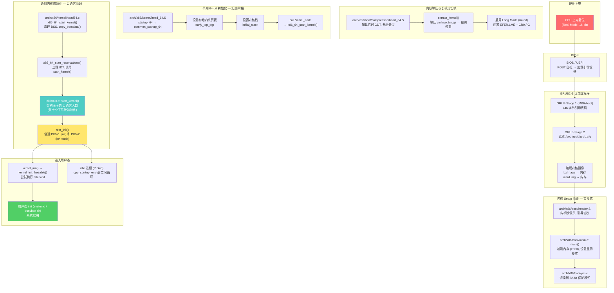

# 实验六 Mermaid 图表 — 实验数据及结果分析

> 配合实验报告使用 | 可直接粘贴到支持 Mermaid 的 Markdown 编辑器或截图使用

---

## 1. Linux内核初始化的主要过程（宏观概览）



---

## 2. Linux内核初始化的主要函数跳转流程（详细调用链）

```mermaid
flowchart TD
    START["startup_64()\narch/x86/kernel/head_64.S:38"]
    S64_SETUP["__startup_64_setup_gdt_idt()\n设置 GDT / IDT"]
    S64_COMPUTE["计算内核 64-bit 虚拟地址偏移"]
    S64_PGTBL["__startup_64()\n建立 early_top_pgt (早期页表)\n恒等映射 + 内核映射"]
    COMMON64["common_startup_64()\narch/x86/kernel/head_64.S:198"]
    SET_STACK["设置 initial_stack → 内核栈"]
    JMP_INIT["callq *initial_code(%rip)\ninitial_code = x86_64_start_kernel"]

    X64_START["x86_64_start_kernel()\narch/x86/kernel/head64.c:222\n━━━━━━━━━━━━━━━━━━━━━\n• 清理 BSS 段\n• copy_bootdata() 解析引导参数\n• load_ucode_bsp() 加载 CPU 微码"]
    X64_RESV["x86_64_start_reservations()\narch/x86/kernel/head64.c:294\n━━━━━━━━━━━━━━━━━━━━━\n• 加载早期 IDT\n• 调用 start_kernel()"]

    SK["start_kernel()\ninit/main.c:911\n━━━━━━━━━━━━━━━━━━━━━\nC 语言通用内核入口\nlocal_irq_disable() 关中断"]
    SK1["set_task_stack_end_magic(&init_task)"]
    SK2["smp_setup_processor_id()\nboot_cpu_init()"]
    SK3["setup_arch(&command_line)\n→ x86 架构特定初始化\n   (内存区域, memblock, ACPI, 页表)"]
    SK4["mm_init()\n→ buddy 分配器 + slab 分配器\n   + vmalloc 初始化"]
    SK5["sched_init()\n→ 进程调度器初始化\n   (CFS / RT / MFQ 等调度类)"]
    SK6["trap_init() + init_IRQ()\n→ 中断描述符表 + 中断控制器"]
    SK7["console_init()\n→ 控制台驱动\n   (此后 printk 输出可见)"]
    SK8["time_init() + tick_init()\n→ 定时器 + 时钟事件"]

    RI["rest_init()\ninit/main.c:711\n━━━━━━━━━━━━━━━━━━━━━\nstart_kernel() 的最后一个调用"]

    RI_MAIN["rcu_scheduler_starting()"]
    RI_INIT["user_mode_thread(kernel_init, ...)\n→ 创建 PID=1 (init 进程)"]
    RI_KTHREAD["user_mode_thread(kthreadd, ...)\n→ 创建 PID=2 (内核线程守护者)"]
    RI_IDLE["schedule_preempt_disabled()\ncpu_startup_entry(CPUHP_ONLINE)\n→ 当前任务变为 idle (PID=0)\n→ 进入空闲循环 (永不返回)"]

    KI["kernel_init() — PID=1\ninit/main.c:1477"]
    KI_FREE["kernel_init_freeable()\n→ 加载内置模块\n→ 初始化设备驱动\n→ 挂载根文件系统"]
    KI_EXEC["尝试执行 init 程序:\n/sbin/init → /etc/init → /bin/init → /bin/sh"]

    KT["kthreadd() — PID=2\n→ 创建其他内核线程\n   (ksoftirqd, kworker, ...)"]

    IDLE["idle 进程 — PID=0\ncpu_startup_entry()\n→ do_idle() 循环\n→ 无就绪任务时执行"]

    USER["用户态\nbusybox sh / systemd\n系统正常运行"]

    START --> S64_SETUP --> S64_COMPUTE --> S64_PGTBL --> COMMON64
    COMMON64 --> SET_STACK --> JMP_INIT
    JMP_INIT --> X64_START --> X64_RESV --> SK

    SK --> SK1 --> SK2 --> SK3
    SK3 --> SK4 --> SK5
    SK5 --> SK6 --> SK7 --> SK8
    SK8 --> RI

    RI --> RI_MAIN --> RI_INIT
    RI_INIT --> RI_KTHREAD
    RI_KTHREAD --> RI_IDLE

    RI_INIT -.-> KI
    KI --> KI_FREE --> KI_EXEC
    KI_EXEC -.-> USER

    RI_KTHREAD -.-> KT
    RI_IDLE -.-> IDLE

    style START fill:#ff6b6b,color:#fff
    style SK fill:#4ecdc4,color:#fff
    style RI fill:#ffe66d
    style USER fill:#51cf66,color:#fff
    style X64_START fill:#b197fc,color:#fff
```



---

## 3. GDB 调试内核截图

> 此部分为预留占位，请将实际截图粘贴到此处。

### 截图说明

| 编号 | 内容 | 对应 GDB 命令 |
|------|------|-------------|
| 3-a | GDB 连接 QEMU，断点命中 `start_kernel` | `target remote :1234` `b start_kernel` `c` |
| 3-b | `bt` 栈回溯（调用链） | `bt` |
| 3-c | `info registers` 寄存器状态 | `info registers` |

### 栈回溯参考（待替换为截图）

```
(gdb) bt
#0  start_kernel () at init/main.c:912
#1  0xffffffff832a06ac in x86_64_start_reservations (...)
    at arch/x86/kernel/head64.c:310
#2  0xffffffff832a082d in x86_64_start_kernel (...)
    at arch/x86/kernel/head64.c:291
#3  0xffffffff812c80cd in secondary_startup_64 ()
    at arch/x86/kernel/head_64.S:418
```

---

## 4. 添加内核调试打印信息的输出截图

> 此部分为预留占位，请将实际截图粘贴到此处。

### printk 插入位置代码

在 `init/main.c` 中添加：

```c
// start_kernel() 开头 (~line 913)
pr_notice("[EXP6] === start_kernel() called ===\n");

// start_kernel() 中 console_init() 之后 (~line 1053)
pr_notice("[EXP6] console initialized — printk now visible\n");

// rest_init() 开头 (~line 713)
pr_notice("[EXP6] === rest_init() — creating init process ===\n");
```

### 预期 dmesg 输出（待替换为截图）

```
$ dmesg | grep EXP6
[    0.051234] [EXP6] === start_kernel() called ===
[    0.234567] [EXP6] console initialized — printk now visible
[    0.567890] [EXP6] === rest_init() — creating init process ===
```

---

## 使用说明

1. **图表 1、2** 可直接在支持 Mermaid 的编辑器中渲染后截图插入报告，或直接在 VS Code / Typora 中打开本文件预览
2. **图表 3、4** 为占位区域，需将实际实验截图替换进去
3. 若需导出为独立图片：
   ```bash
   # 方法1: 使用 mermaid-cli
   npx @mermaid-js/mermaid-cli -i diagrams.md -o diagrams.png
   
   # 方法2: 在线渲染 → 截图
   # 复制 mermaid 代码到 https://mermaid.live → 导出 PNG
   ```
